# Claude Rich Terminal

Mermaid diagrams drawn inside Claude Code replies, instead of raw source, and a truecolor status line under the prompt with a Token Weather forecast of the context window.

<picture>
  <source media="(prefers-color-scheme: dark)" srcset="docs/images/demo-dark.gif">
  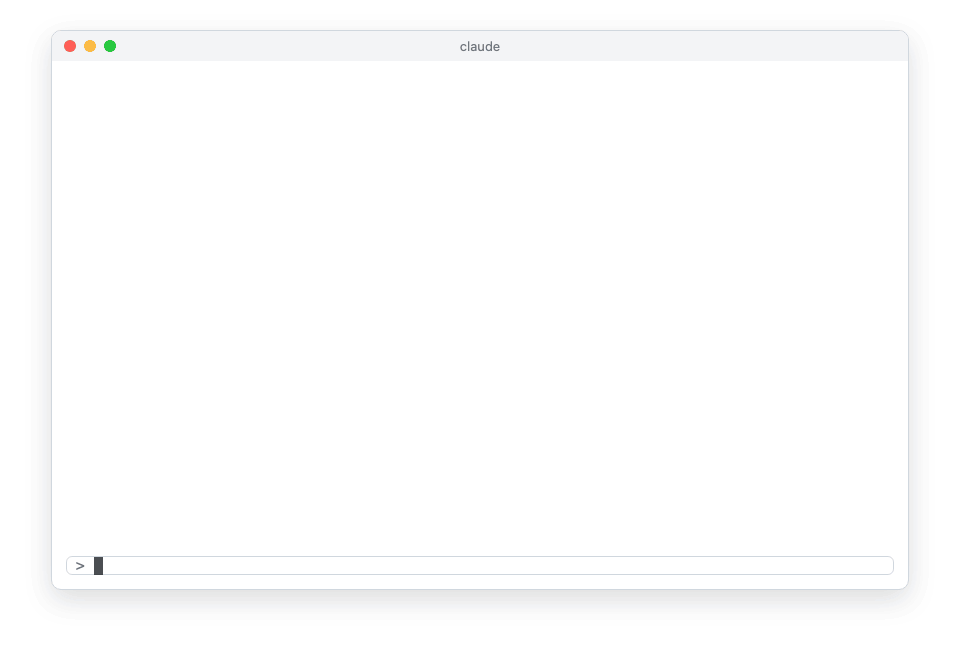
</picture>

The diagram in the animation is the plugin's own output: its text drawing, then its picture in Ghostty or kitty. The window around it is recreated. The [gallery](#gallery) shows one diagram of every supported type.

## What it does

- **Draws diagrams in place.** Each Mermaid block in a reply, including one inside a quote or list, is replaced by a drawing on screen only. The stored message is unchanged, and ctrl+o shows the source.
- **Fits the terminal.** A left-to-right flowchart too wide for the window is redrawn top-to-bottom. If it still does not fit, the source is shown. Changing the terminal's width redraws.
- **Optional pictures.** In Ghostty or kitty, diagrams can be drawn as real images instead (see [Settings](#settings)).
- **Full view in the browser.** `/rich open` opens a diagram as a zoomable page that works offline.
- **A status line under the prompt.** Folder and git state, model and effort, context with Token Weather, time and cost, account and rate limits, restyled live with `/rich status` (see [Status line](#status-line)).

Terminal drawings cover flowcharts, sequence, state, class, ER and xy charts. Other types (pie, gantt, mindmap, timeline, gitGraph, journey) stay as source, unless pictures are on.

## Gallery

<!-- gallery:start -->

One diagram of every supported type, in a reply in a terminal 120 columns wide. Each diagram is the plugin's own output; only the window around it is recreated. The first six types are drawn as text in any terminal and as pictures in Ghostty and kitty; the rest are pictures only. Charts marked "example data" or "illustrative" show made-up numbers.

<details><summary><b>Flowchart</b> (text and picture)</summary>

Text drawing. Too wide left to right for the terminal, so the plugin redrew it top to bottom.

<picture>
  <source media="(prefers-color-scheme: dark)" srcset="docs/images/gallery/flowchart-text-dark.png">
  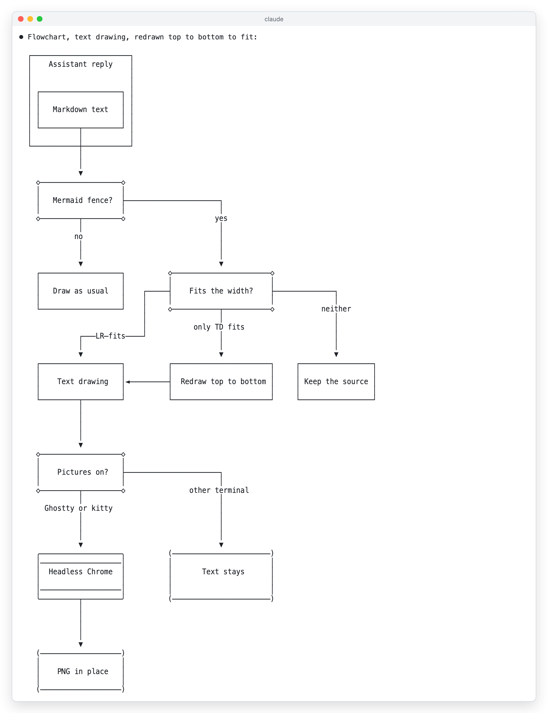
</picture>

Picture.

<picture>
  <source media="(prefers-color-scheme: dark)" srcset="docs/images/gallery/flowchart-picture-dark.png">
  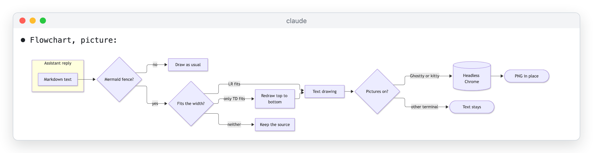
</picture>

Source:

```text
flowchart LR
    subgraph reply [Assistant reply]
        M[Markdown text]
    end
    M --> F{Mermaid fence?}
    F -->|no| N[Draw as usual]
    F -->|yes| W{Fits the width?}
    W -->|LR fits| T[Text drawing]
    W -->|only TD fits| R[Redraw top to bottom] --> T
    W -->|neither| S[Keep the source]
    T --> P{Pictures on?}
    P -->|Ghostty or kitty| C[(Headless Chrome)]
    C --> I([PNG in place])
    P -->|other terminal| K([Text stays])
```

</details>

<details><summary><b>Sequence diagram</b> (text and picture)</summary>

Text drawing.

<picture>
  <source media="(prefers-color-scheme: dark)" srcset="docs/images/gallery/sequence-text-dark.png">
  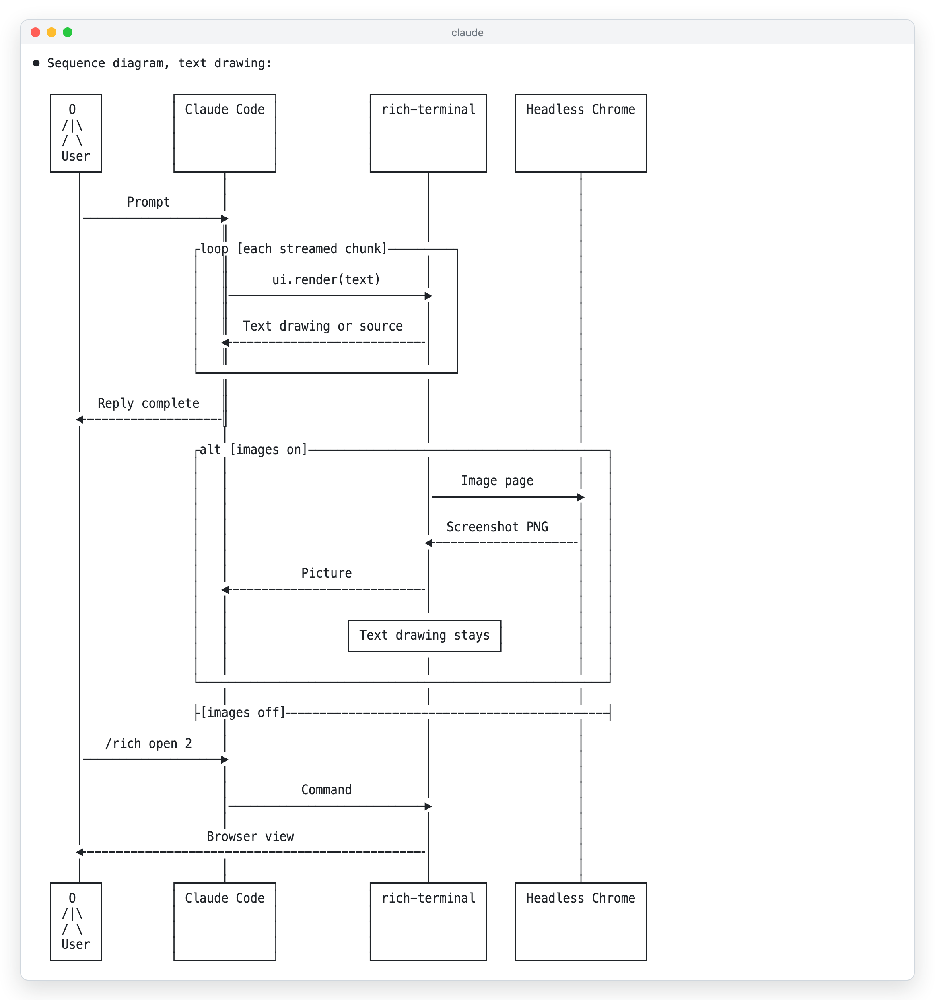
</picture>

Picture.

<picture>
  <source media="(prefers-color-scheme: dark)" srcset="docs/images/gallery/sequence-picture-dark.png">
  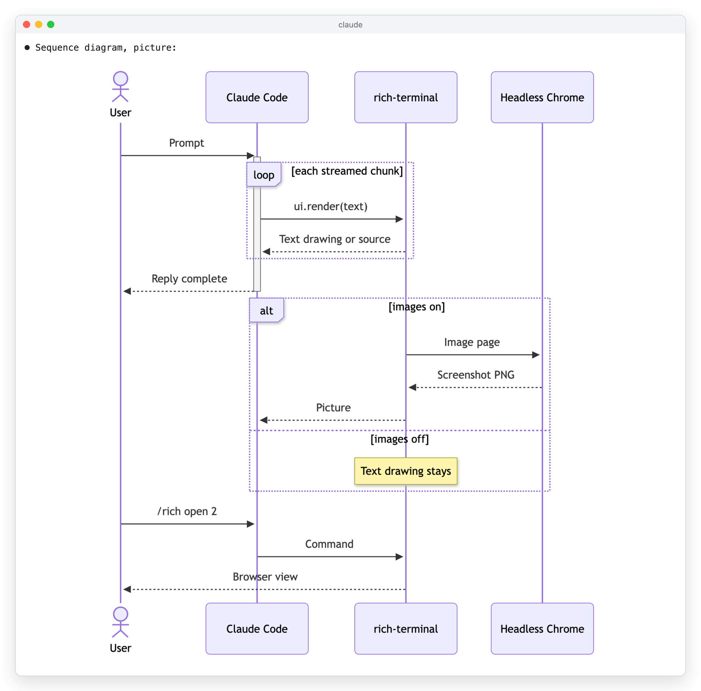
</picture>

Source:

```text
sequenceDiagram
    actor U as User
    participant CC as Claude Code
    participant RT as rich-terminal
    participant HC as Headless Chrome
    U->>CC: Prompt
    activate CC
    loop each streamed chunk
        CC->>RT: ui.render(text)
        RT-->>CC: Text drawing or source
    end
    CC-->>U: Reply complete
    deactivate CC
    alt images on
        RT->>HC: Image page
        HC-->>RT: Screenshot PNG
        RT-->>CC: Picture
    else images off
        Note over RT: Text drawing stays
    end
    U->>CC: /rich open 2
    CC->>RT: Command
    RT-->>U: Browser view
```

</details>

<details><summary><b>State diagram</b> (text and picture)</summary>

Text drawing.

<picture>
  <source media="(prefers-color-scheme: dark)" srcset="docs/images/gallery/state-text-dark.png">
  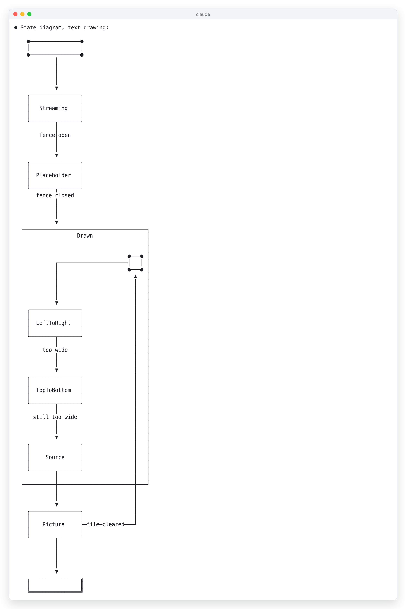
</picture>

Picture.

<picture>
  <source media="(prefers-color-scheme: dark)" srcset="docs/images/gallery/state-picture-dark.png">
  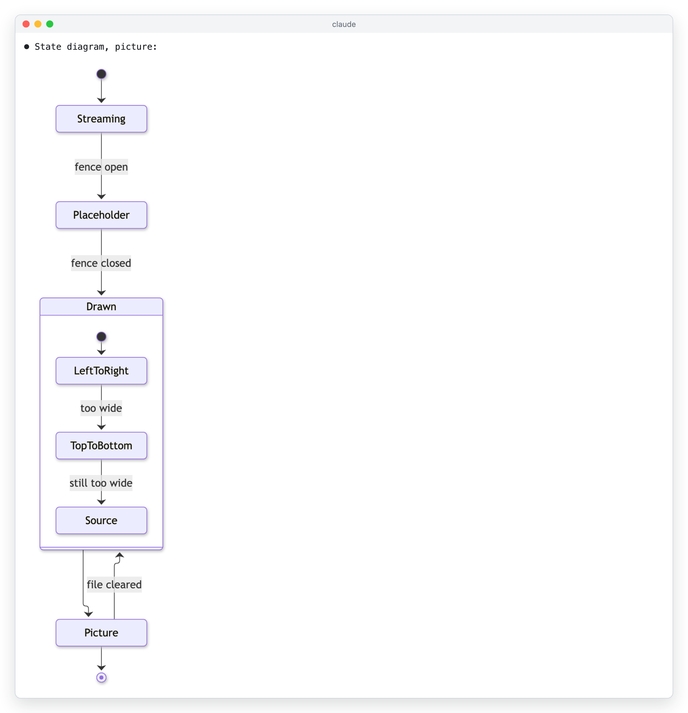
</picture>

Source:

```text
stateDiagram-v2
    [*] --> Streaming
    Streaming --> Placeholder: fence open
    Placeholder --> Drawn: fence closed
    state Drawn {
        [*] --> LeftToRight
        LeftToRight --> TopToBottom: too wide
        TopToBottom --> Source: still too wide
    }
    Drawn --> Picture
    Picture --> Drawn: file cleared
    Picture --> [*]
```

</details>

<details><summary><b>Class diagram</b> (text and picture)</summary>

Text drawing.

<picture>
  <source media="(prefers-color-scheme: dark)" srcset="docs/images/gallery/class-text-dark.png">
  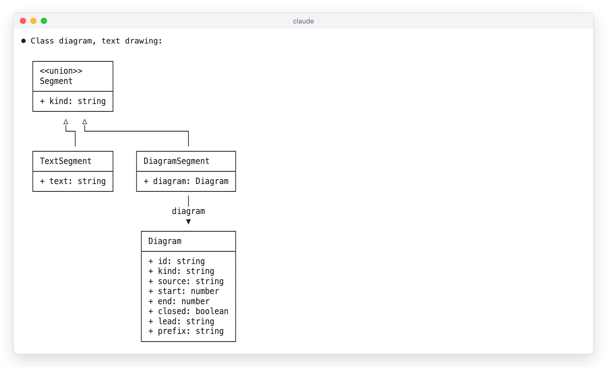
</picture>

Picture.

<picture>
  <source media="(prefers-color-scheme: dark)" srcset="docs/images/gallery/class-picture-dark.png">
  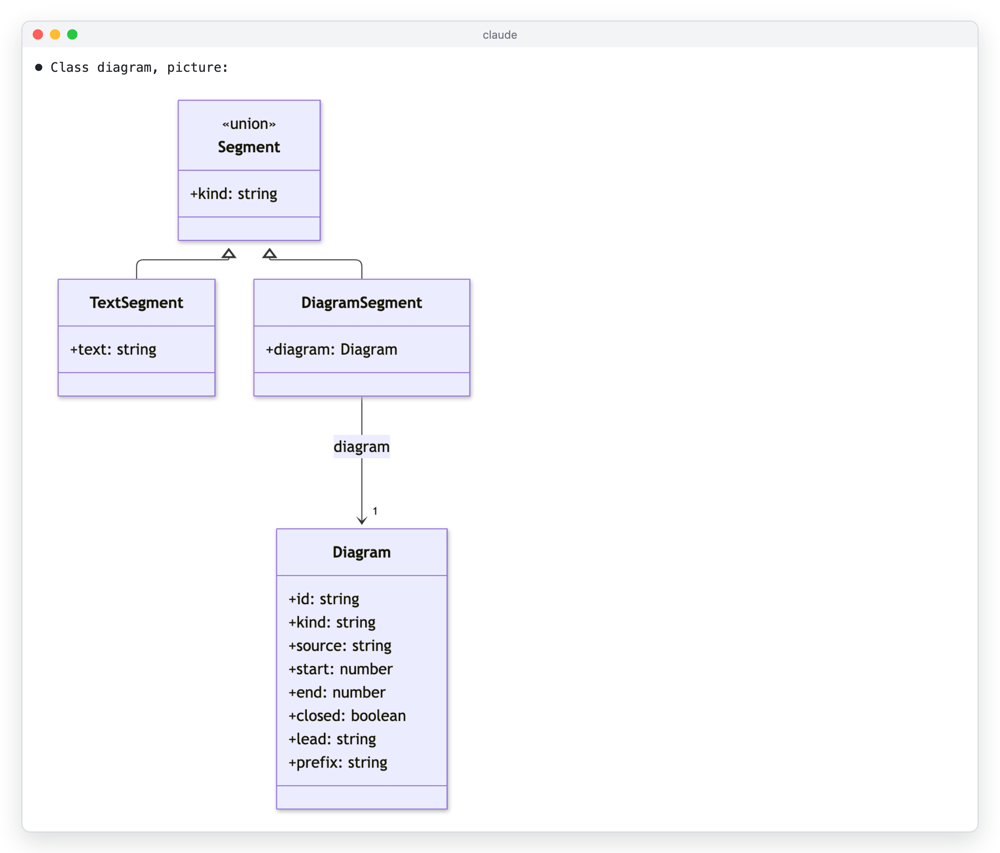
</picture>

Source:

```text
classDiagram
    class Diagram {
        +id: string
        +kind: string
        +source: string
        +start: number
        +end: number
        +closed: boolean
        +lead: string
        +prefix: string
    }
    class Segment {
        <<union>>
        +kind: string
    }
    class TextSegment {
        +text: string
    }
    class DiagramSegment {
        +diagram: Diagram
    }
    Segment <|-- TextSegment
    Segment <|-- DiagramSegment
    DiagramSegment --> "1" Diagram : diagram
```

</details>

<details><summary><b>Entity relationship diagram</b> (text and picture)</summary>

Text drawing.

<picture>
  <source media="(prefers-color-scheme: dark)" srcset="docs/images/gallery/er-text-dark.png">
  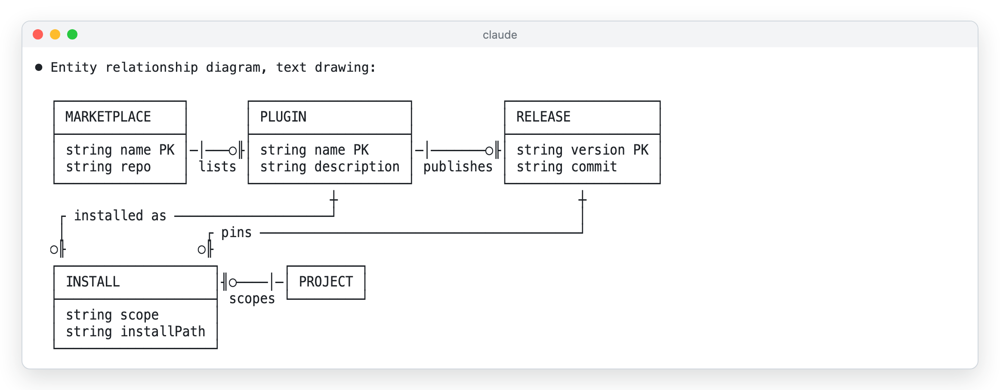
</picture>

Picture.

<picture>
  <source media="(prefers-color-scheme: dark)" srcset="docs/images/gallery/er-picture-dark.png">
  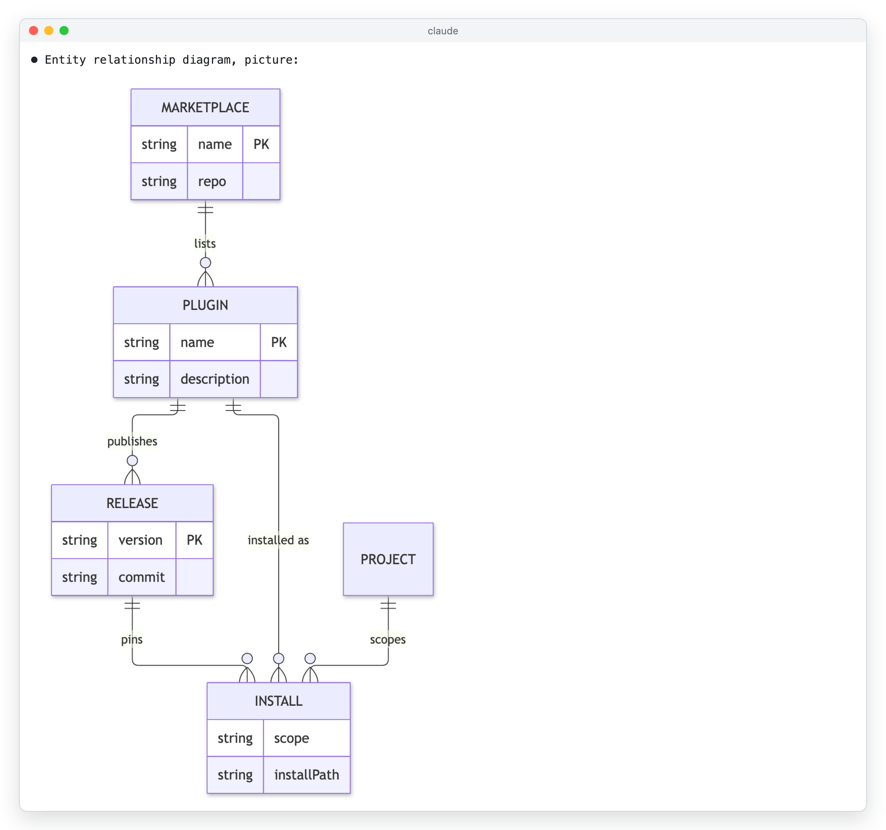
</picture>

Source:

```text
erDiagram
    MARKETPLACE ||--o{ PLUGIN : lists
    PLUGIN ||--o{ RELEASE : publishes
    PLUGIN ||--o{ INSTALL : "installed as"
    PROJECT ||--o{ INSTALL : scopes
    RELEASE ||--o{ INSTALL : pins
    MARKETPLACE {
        string name PK
        string repo
    }
    PLUGIN {
        string name PK
        string description
    }
    RELEASE {
        string version PK
        string commit
    }
    INSTALL {
        string scope
        string installPath
    }
```

</details>

<details><summary><b>XY chart</b> (text and picture)</summary>

Text drawing.

<picture>
  <source media="(prefers-color-scheme: dark)" srcset="docs/images/gallery/xychart-text-dark.png">
  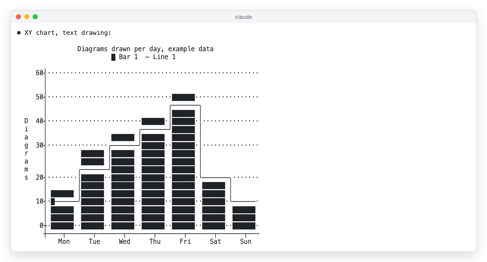
</picture>

Picture.

<picture>
  <source media="(prefers-color-scheme: dark)" srcset="docs/images/gallery/xychart-picture-dark.png">
  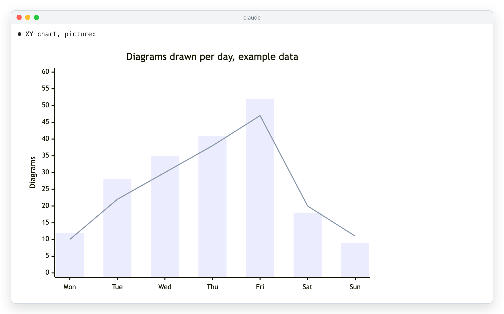
</picture>

Source:

```text
xychart-beta
    title "Diagrams drawn per day, example data"
    x-axis [Mon, Tue, Wed, Thu, Fri, Sat, Sun]
    y-axis "Diagrams" 0 --> 60
    bar [12, 28, 35, 41, 52, 18, 9]
    line [10, 22, 30, 38, 47, 20, 11]
```

</details>

<details><summary><b>Pie chart</b> (picture)</summary>

<picture>
  <source media="(prefers-color-scheme: dark)" srcset="docs/images/gallery/pie-picture-dark.png">
  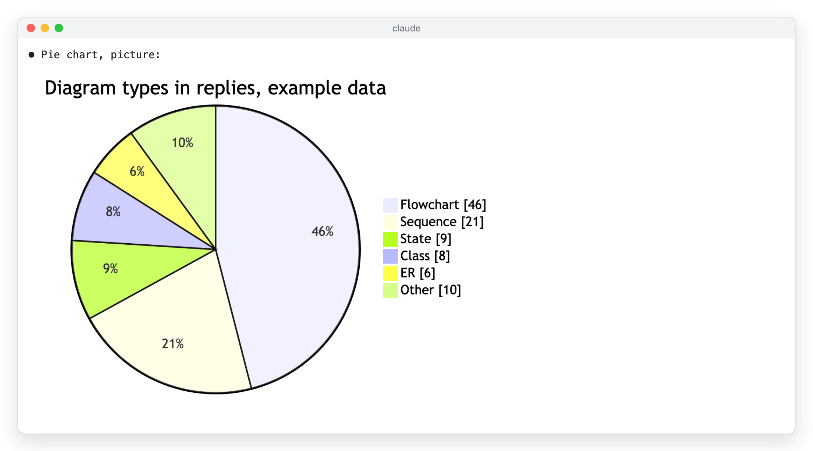
</picture>

Source:

```text
pie showData title Diagram types in replies, example data
    "Flowchart" : 46
    "Sequence" : 21
    "State" : 9
    "Class" : 8
    "ER" : 6
    "Other" : 10
```

</details>

<details><summary><b>Gantt chart</b> (picture)</summary>

<picture>
  <source media="(prefers-color-scheme: dark)" srcset="docs/images/gallery/gantt-picture-dark.png">
  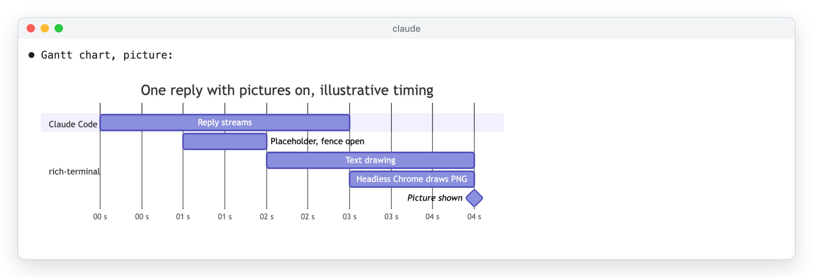
</picture>

Source:

```text
gantt
    title One reply with pictures on, illustrative timing
    dateFormat x
    axisFormat %S s
    section Claude Code
        Reply streams             :stream, 0, 3000ms
    section rich-terminal
        Placeholder, fence open   :hold, 1000, 1000ms
        Text drawing              :text, after hold, 2500ms
        Headless Chrome draws PNG :chrome, after stream, 1500ms
        Picture shown             :milestone, after chrome, 0ms
```

</details>

<details><summary><b>Mindmap</b> (picture)</summary>

<picture>
  <source media="(prefers-color-scheme: dark)" srcset="docs/images/gallery/mindmap-picture-dark.png">
  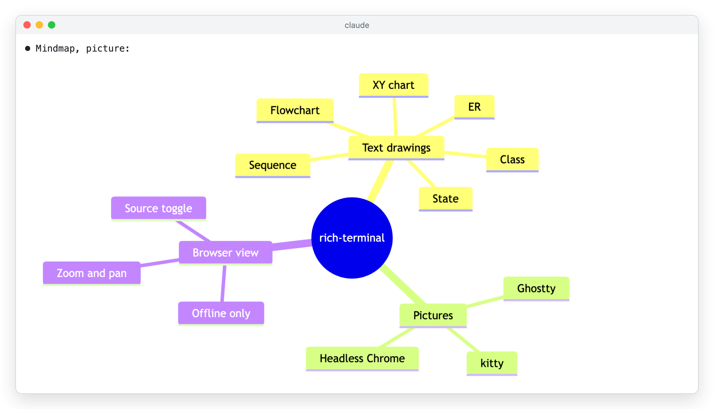
</picture>

Source:

```text
mindmap
  root((rich-terminal))
    Text drawings
      Flowchart
      Sequence
      State
      Class
      ER
      XY chart
    Pictures
      Ghostty
      kitty
      Headless Chrome
    Browser view
      Zoom and pan
      Source toggle
      Offline only
```

</details>

<details><summary><b>Timeline</b> (picture)</summary>

<picture>
  <source media="(prefers-color-scheme: dark)" srcset="docs/images/gallery/timeline-picture-dark.png">
  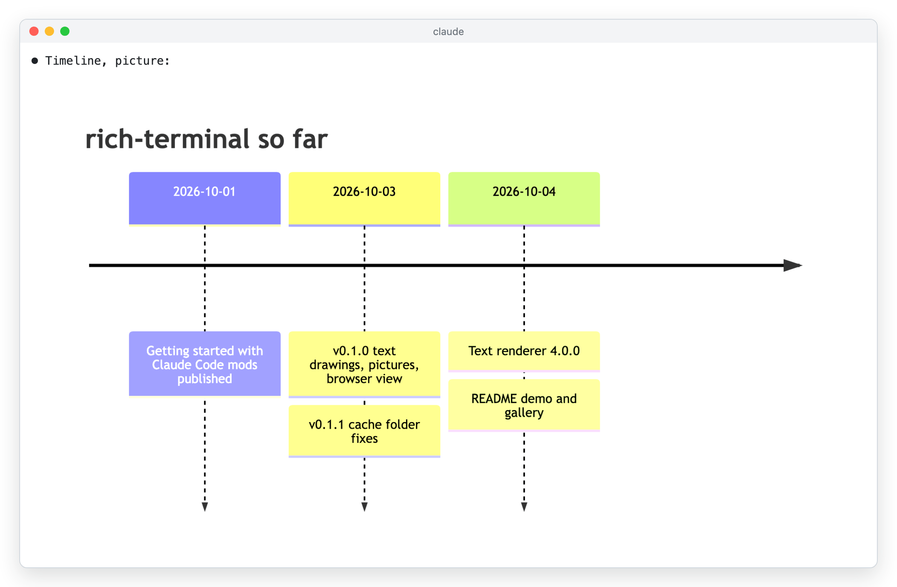
</picture>

Source:

```text
timeline
    title rich-terminal so far
    2026-10-01 : Getting started with Claude Code mods published
    2026-10-03 : v0.1.0 text drawings, pictures, browser view
               : v0.1.1 cache folder fixes
    2026-10-04 : Text renderer 4.0.0
               : README demo and gallery
```

</details>

<details><summary><b>Git graph</b> (picture)</summary>

<picture>
  <source media="(prefers-color-scheme: dark)" srcset="docs/images/gallery/gitgraph-picture-dark.png">
  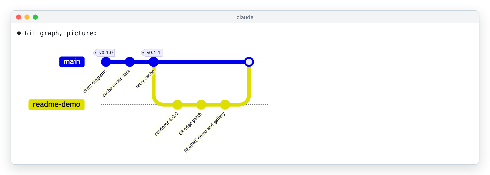
</picture>

Source:

```text
gitGraph
    commit id: "draw diagrams" tag: "v0.1.0"
    commit id: "cache under data"
    commit id: "retry cache" tag: "v0.1.1"
    branch readme-demo
    checkout readme-demo
    commit id: "renderer 4.0.0"
    commit id: "ER edge patch"
    commit id: "README demo and gallery"
    checkout main
    merge readme-demo
```

</details>

<details><summary><b>User journey</b> (picture)</summary>

<picture>
  <source media="(prefers-color-scheme: dark)" srcset="docs/images/gallery/journey-picture-dark.png">
  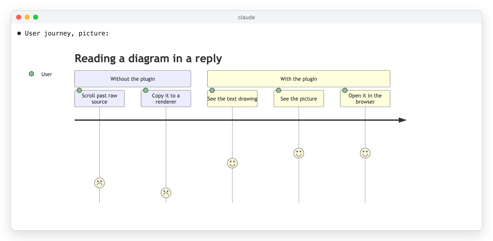
</picture>

Source:

```text
journey
    title Reading a diagram in a reply
    section Without the plugin
        Scroll past raw source: 2: User
        Copy it to a renderer: 1: User
    section With the plugin
        See the text drawing: 4: User
        See the picture: 5: User
        Open it in the browser: 5: User
```

</details>

<!-- gallery:end -->

## Status line

A status line under the prompt, here in the three-row layout (`/rich status lines`; colors omitted):

```
~/myproject/src > main ↑1 +12 -3 ?2
Fable · xhigh > ☁ ctx 42% > 12m · $1.23
xiaolai > 5h 12% · 7d 67%
```

Run `/rich status setup` once. A plugin cannot draw under the prompt itself, only Claude Code's `statusLine` setting can, and that setting needs a stable path, while the plugin's own folder moves on every update. So setup copies three scripts from the plugin (`rich-status.sh`, the renderer; `rich-status-ctl.sh`, which `/rich status` runs; and `rich-status-lib.sh`, their shared settings code) into Claude Code's config folder (`~/.claude/`, or `$CLAUDE_CONFIG_DIR`) and points `statusLine` at them, keeping every other setting. After a plugin update, the next session brings the copies up to date, but only copies this plugin installed and nobody has edited since; an edited copy is left alone and `/rich status check` reports it.

Before 1.0.0 these files were named `statusline-command.sh`, `statusline-ctl.sh`, `statusline-lib.sh` and `statusline.state`. A session start moves such a setup to the new names, settings included, when the old copies are exactly what the plugin installed; otherwise `/rich status check` says so, and `/rich status setup` moves it, leaving an edited old copy in place.

### Segments

Segments are grouped A / B / C for the multi-line layouts. Each appears only when it has data.

| Group | Segment | Content |
| --- | --- | --- |
| A | Folder | Project-relative path (`project/sub/dir`) inside the session's project, otherwise the `~`-abbreviated absolute path |
| A | Branch | Green when the working tree is clean, amber when anything is modified or untracked; `↑n ↓m` against the upstream |
| A | Changes | `+insertions −deletions` against `HEAD`, plus `?n` untracked files |
| B | Model | Model short name (`Fable`, `Opus`, …) and the live reasoning effort |
| B | Context | `ctx 42%`, or an 8-cell `█████░░░` gauge with `bar`, with [Token Weather](#token-weather) around it |
| B | Time · cost | Session duration (`45s`, `12m`, `1h5m`) and total API cost |
| C | Account | The signed-in account from `~/.claude.json`, cached for 180 s: the email's local part, or the whole address |
| C | Limits | 5-hour and 7-day rate-limit use; reset countdowns like `(3h)` or `(2d5h)` with `reset` |

The context and limit gauges share one color scale: green below 60 %, amber from 60 %, red from 85 %.

### Token Weather

The context gauge is led by a forecast icon: `☁ ctx 42%`.

| Context fill | Icon | Nerd Font glyph (`icons`) | Forecast |
| --- | --- | --- | --- |
| below 25 % | ☀ | U+E30D `weather-day_sunny` | Clear |
| 25–49 % | ☁ | U+E312 `weather-cloudy` | Cloudy |
| 50–74 % | ☂ | U+E319 `weather-showers` | Showers |
| 75–89 % | ☇ | U+E31D `weather-thunderstorm` | Storm |
| 90 % and up | ↯ | U+E351 `weather-tornado` | Compact soon |

The standard symbols are missing from most coding fonts, so the terminal borrows them from a fallback font and they can look out of place. With a Nerd Font, `/rich status icons` switches to its weather glyphs, one cell wide in a Mono variant.

### Status line settings

`/rich status <action>` changes one setting; it shows on the next status update. The settings live in `~/.claude/rich-status.state` as `KEY=VALUE` lines, which you can also edit by hand.

| Action | Key | Default | Effect |
| --- | --- | --- | --- |
| `theme` | `THEME`, `STYLE` | plain | Cycle the look: plain → gray → aurora → sunset → forest; the four gradients draw powerline segments |
| `style` | `STYLE` | `plain` | Toggle powerline ↔ plain, keeping the theme |
| `lines` | `LINES` | `1` | Cycle `auto` → `1` → `2` → `3` rows; `auto` measures the terminal |
| `toggle` / `hide` / `show` | `HIDDEN` | `0` | Hide the status line (it prints one blank line), or show it |
| `bar` | `SHOW_BAR` | `0` | Context as a `████░░` gauge instead of `ctx N%` |
| `account` | `SHOW_ACCOUNT` | `1` | Show or hide the account; `ACCOUNT_LOCAL=0` in the file shows the whole email |
| `reset` | `SHOW_RESET` | `0` | Reset countdowns after the 5h/7d figures |
| `weather` | `SHOW_WEATHER` | `1` | The Token Weather icon on the context gauge |
| `icons` | `ICONS` | `unicode` | Weather icons: standard symbols, or Nerd Font glyphs (`nerd`) |

Powerline gradients run across each row's segments: gray `#4a4a4a` → `#1e1e1e`, aurora `#1e2a4a` → `#52304f`, sunset `#241f42` → `#5e3040`, forest `#163a34` → `#2c3a55`. The foreground colors carry meaning in both styles: green clean/ahead/low, amber dirty/behind/mid, red deletions/high, blue path, purple model, gold cost.

### How the status line works

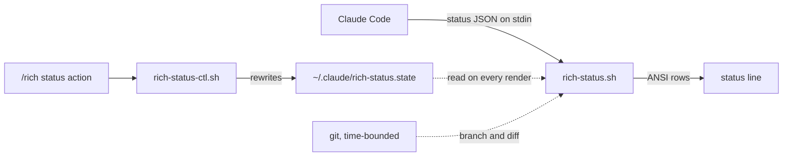
```mermaid
flowchart LR
    CC["Claude Code"] -->|"status JSON on stdin"| R["rich-status.sh"]
    R -->|"ANSI rows"| SL["status line"]
    CMD["/rich status action"] --> CTL["rich-status-ctl.sh"]
    CTL -->|"rewrites"| ST["~/.claude/rich-status.state"]
    ST -.->|"read on every render"| R
    G["git, time-bounded"] -.->|"branch and diff"| R
```

Claude Code runs the `statusLine` command on every status update and pipes it a JSON payload, which the renderer parses with `jq`. `/rich status` runs the controller from the plugin itself; it rewrites the state file through a temp file and an atomic rename. `LINES=auto` reads the terminal's width from `/dev/tty`, since the payload carries none, and falls back to three rows where that fails.

Git is bounded per call (`GIT_BUDGET`, default 2 s) and in total (`GIT_TOTAL`, default 3 s): Claude Code blanks a status line that takes 5 s, so a slow repository loses only its git segments. Git runs nothing a repository's config names: every call passes `-c core.fsmonitor=false`, and the diff passes `--no-ext-diff --no-textconv`. Set either budget, 1 to 60 whole seconds, in the command, e.g. `GIT_BUDGET=1 bash ~/.claude/rich-status.sh`; any other value is ignored.

### Requirements

| Requirement | Needed for | Without it |
| --- | --- | --- |
| `jq` | parsing the status JSON: the whole line | nearly empty; macOS ships `/usr/bin/jq`, else `brew install jq` |
| bash, standard Unix tools | running the scripts | stock macOS bash 3.2 works |
| A truecolor terminal (Ghostty, iTerm2, kitty, WezTerm) | the colors | colors degrade in Terminal.app; layout still works |
| The U+E0B0 glyph (a Nerd Font; Ghostty bundles the symbols) | the powerline looks' arrows | missing-glyph boxes; `plain` needs none |
| Nerd Font weather glyphs | `icons` set to `nerd` | missing-glyph boxes; keep `unicode` |
| `git` | the branch and changes | those segments hide |
| `timeout` or `perl` | bounding one slow git call | git is bounded only between calls |

### Status line troubleshooting

| Symptom | Cause and fix |
| --- | --- |
| Nothing under the prompt | `/rich status check` shows whether `statusLine` runs the copied scripts; `/rich status setup` wires it |
| Nearly empty line | `jq` is missing |
| Boxes instead of arrows | a powerline look without the U+E0B0 glyph: use a Nerd Font, or `/rich status style` for plain |
| Weather icon looks out of place | the font lacks the symbol: with a Nerd Font, `/rich status icons` |
| Toggle seems to do nothing | the line redraws on the next status update: send a message or wait |
| `lines auto` always gives 3 rows | `/dev/tty` is not readable here: choose `1`, `2` or `3` |
| `check` says a copy was edited | you or another tool changed it, so updates leave it alone; `/rich status setup` replaces it |

To remove it: delete the `statusLine` key from `settings.json`, then the copied `rich-status*.sh`, `rich-status.state` and `.rich-status-account` in `~/.claude/`.

## Commands

| Command | Effect |
|---|---|
| `/rich list` | Number the diagrams in this conversation, with their ids |
| `/rich open [n\|id]` | Open diagram *n* (or by id) in the default browser; the latest without one. Uses `open` on macOS and `xdg-open` on Linux |
| `/rich on` / `/rich off` | Draw diagrams, or leave replies as Claude Code draws them |
| `/rich status` | Show the status line settings |
| `/rich status setup` | Copy the status line scripts and point the `statusLine` setting at them |
| `/rich status check` | Say whether each copied script is up to date, older, edited or missing, and whether the `statusLine` setting runs the copies |
| `/rich status <action>` | Change one status line setting; see [Status line settings](#status-line-settings) |

## Settings

In `/config`, under this plugin:

| Setting | Default | Meaning |
|---|---|---|
| `images` | off | Draw diagrams as pictures. Needs a terminal with the kitty graphics protocol (Ghostty, kitty; not inside tmux) and Chrome, Chromium, Edge or Brave. Elsewhere the text drawing is kept |
| `imageTheme` | `dark` | Mermaid theme for pictures: `dark`, or `default` for a light terminal |
| `browser` | empty | Path to the browser that draws pictures; empty finds one |

Pictures are drawn once per diagram by headless Chrome. The text drawing shows until the picture is ready, about a second and a half. Pages are drawn offline: their content policy blocks every network request, so a diagram cannot make the browser fetch anything.

## Cache

Browser pages and pictures are kept in `~/.claude/plugins/data/rich-terminal/`, an owner-only folder. They contain the source of the diagrams you opened or drew as pictures, plus a headless-Chrome profile per session. Nothing is removed automatically; delete the folder at any time to clear it.

## Install

Requires Claude Code 2.1.287 or later.

```bash
claude plugin marketplace add xiaolai/claude-plugin-marketplace
claude plugin install rich-terminal@xiaolai
```

To try it from a checkout instead, run `claude --plugin-dir /path/to/claude-rich-terminal`.

## Limitations

- A Mermaid block is recognised at top level and inside quotes and list items whose markers sit on the fence's own line or directly above it. Unusual Markdown nesting, such as lazy continuation lines, can leave a block as source or end it early.
- In a dense text drawing, an edge label can land on another line or a container's border, and an edge can cross a box. The picture and `/rich open` draw such diagrams exactly.
- The terminal renderer skips a line it cannot parse and draws the rest; a diagram with a syntax error can therefore be drawn incompletely. `/rich open` shows Mermaid's own error.
- A diagram that loads external images draws in the browser without them: the pages block every network request.

## Background

This plugin came out of reading [Getting started with Claude Code mods](https://claude.dev/blog/getting-started-with-claude-code-mods/), published on claude.dev on October 1, 2026.

## Development

```bash
claude plugin validate .claude-plugin/plugin.json
claude plugin test .                       # hooks and core logic, in Claude Code's test kit
node scripts/check-pages.mjs               # browser pages in headless Chrome: drawn, no links, no network
npx tsc -p . && npx tsc -p tsconfig.viewer.json
bash statusline/tests/run.sh               # status line scripts: golden output and security contracts
```

`hooks/core.ts` (diagrams) and `hooks/statusline.ts` (the status line's setup) hold the logic that does not touch Claude Code; `hooks/register.tsx` holds the hooks. The status line itself is the bash in `statusline/scripts/`; its tests pin the renderer's exact output (`bash statusline/tests/run.sh record` re-records it) and run under the stock macOS bash 3.2. The renderers are vendored; see [THIRD_PARTY_NOTICES.md](THIRD_PARTY_NOTICES.md).

## License

MIT; see [LICENSE](LICENSE). The bundled Mermaid renderers are MIT as well; see [THIRD_PARTY_NOTICES.md](THIRD_PARTY_NOTICES.md).
